# Flux Demo - Distributed Tracing with OpenTelemetry

This repository demonstrates a cloud-native microservices architecture with distributed tracing using Flux GitOps, OpenTelemetry auto-instrumentation, and observability best practices.

## 🏗️ Real-World GitOps Repository Architecture

In a production environment, you would typically have multiple repositories following separation of concerns:


### Repository Separation Strategy

#### 1. **Application Repositories** (`java-service`, `node-service`, etc.)
- Contains application source code only
- CI/CD pipeline builds and pushes container images
- Developers work here daily
- No Kubernetes manifests (separation of concerns)

```yaml
# Example: java-service/.gitlab-ci.yml
stages:
  - build
  - test
  - publish

publish:
  stage: publish
  script:
    - docker build -t $REGISTRY/java-service:$VERSION .
    - docker push $REGISTRY/java-service:$VERSION
```

#### 2. **Flux Configuration Repository** (`flux-config`)
- Contains all Kubernetes manifests and Flux configurations
- No application code
- Managed by platform/DevOps team
- Single source of truth for cluster state

```
flux-config/
├── clusters/
│   ├── production/
│   │   ├── flux-system/
│   │   ├── infrastructure.yaml
│   │   └── apps.yaml
│   ├── staging/
│   └── development/
├── infrastructure/
│   ├── common/
│   ├── monitoring/
│   ├── ingress/
│   └── sources/
└── apps/
    ├── base/
    └── overlays/
        ├── production/
        ├── staging/
        └── development/
```

#### 3. **Terraform Infrastructure Repository** (`terraform-infra`)
- Provisions cloud infrastructure (EKS/GKE/AKS clusters)
- Installs and configures Flux via Terraform
- Manages cloud resources (VPC, IAM, DNS, etc.)
- See [Complete Terraform Flux Module Example](docs/terraform-flux-example.md)

```hcl
# Example: terraform-infra/modules/flux-bootstrap/main.tf
module "flux_bootstrap" {
  source = "github.com/fluxcd/terraform-provider-flux//modules/bootstrap"

  github_owner         = var.github_owner
  github_repository    = var.flux_config_repo
  github_token         = var.github_token
  target_path          = "clusters/${var.environment}"
  components_extra     = ["image-reflector-controller", "image-automation-controller"]
}
```

### Real-World Workflow

1. **Infrastructure Provisioning** (Day 0)
   ```bash
   # From terraform-infra repo
   terraform apply -var="environment=production"
   # This creates:
   # - Kubernetes cluster
   # - Networking, IAM, storage
   # - Installs Flux pointing to flux-config repo
   ```

2. **Developer Workflow** (Day 2)
   ```bash
   # Developer makes changes in java-service repo
   git commit -m "feat: add new endpoint"
   git push
   # CI/CD automatically:
   # - Runs tests
   # - Builds container: java-service:1.2.3
   # - Pushes to registry
   ```

3. **GitOps Deployment**
   ```yaml
   # Platform team updates flux-config repo
   # apps/overlays/production/java-service-patch.yaml
   - name: java-service
     newTag: 1.2.3  # Or use Flux image automation
   ```

4. **Flux Synchronization**
   - Flux detects changes in `flux-config` repo
   - Applies manifests to cluster
   - Pulls new images from registry
   - Updates running workloads

### Image Tagging and Promotion Strategy

#### Option 1: Single Registry with Tag-Based Promotion (Simpler Setup)

For most organizations, a single registry with different tags per environment provides sufficient isolation:


#### Option 2: Multi-Registry Strategy (SOC2/ISO27001 Compliance)

For organizations requiring strict compliance (SOC2, ISO27001), separate registries provide additional security boundaries:


#### Environment-Specific Image Policies

##### Single Registry Configuration (Option 1)

```yaml
# All environments use the same registry, different tag patterns
# flux-config/clusters/development/image-policies.yaml
apiVersion: image.toolkit.fluxcd.io/v1beta2
kind: ImageRepository
metadata:
  name: demo-service
  namespace: flux-system
spec:
  image: ghcr.io/yourorg/demo-service
  interval: 1m
---
apiVersion: image.toolkit.fluxcd.io/v1beta2
kind: ImagePolicy
metadata:
  name: demo-service-dev
  namespace: flux-system
spec:
  imageRepositoryRef:
    name: demo-service
  policy:
    semver:
      range: ">=1.0.0"  # Any clean semver deploys to dev
---
# flux-config/clusters/staging/image-policies.yaml
apiVersion: image.toolkit.fluxcd.io/v1beta2
kind: ImagePolicy
metadata:
  name: demo-service-staging
  namespace: flux-system
spec:
  imageRepositoryRef:
    name: demo-service  # Same repository
  filterTags:
    pattern: '^[0-9]+\.[0-9]+\.[0-9]+-staging$'
  policy:
    semver:
      range: ">=1.0.0"
---
# flux-config/clusters/production/image-policies.yaml
apiVersion: image.toolkit.fluxcd.io/v1beta2
kind: ImagePolicy
metadata:
  name: demo-service-prod
  namespace: flux-system
spec:
  imageRepositoryRef:
    name: demo-service  # Same repository
  filterTags:
    pattern: '^[0-9]+\.[0-9]+\.[0-9]+-prod$'
  policy:
    semver:
      range: ">=1.0.0"
```

##### Multi-Registry Configuration (Option 2)

```yaml
# Different registries per environment for compliance
# flux-config/clusters/development/image-policies.yaml
apiVersion: image.toolkit.fluxcd.io/v1beta2
kind: ImageRepository
metadata:
  name: demo-service
  namespace: flux-system
spec:
  image: ghcr.io/yourorg/demo-service
  interval: 1m
---
apiVersion: image.toolkit.fluxcd.io/v1beta2
kind: ImagePolicy
metadata:
  name: demo-service-dev
  namespace: flux-system
spec:
  imageRepositoryRef:
    name: demo-service
  policy:
    semver:
      range: ">=1.0.0"  # Any semver version auto-deploys to dev
---
# flux-config/clusters/staging/image-policies.yaml
apiVersion: image.toolkit.fluxcd.io/v1beta2
kind: ImageRepository
metadata:
  name: demo-service-staging
  namespace: flux-system
spec:
  image: staging-registry.company.com/demo-service
  interval: 5m
  secretRef:
    name: staging-registry-auth
---
apiVersion: image.toolkit.fluxcd.io/v1beta2
kind: ImagePolicy
metadata:
  name: demo-service-staging
  namespace: flux-system
spec:
  imageRepositoryRef:
    name: demo-service-staging
  filterTags:
    pattern: '^.*-preprod$'  # Only tags ending with -preprod
  policy:
    semver:
      range: ">=1.0.0-preprod"
---
# flux-config/clusters/production/image-policies.yaml
apiVersion: image.toolkit.fluxcd.io/v1beta2
kind: ImageRepository
metadata:
  name: demo-service-prod
  namespace: flux-system
spec:
  image: prod-registry.company.com/demo-service  # Different registry
  interval: 5m
  secretRef:
    name: prod-registry-auth  # Separate credentials
---
apiVersion: image.toolkit.fluxcd.io/v1beta2
kind: ImagePolicy
metadata:
  name: demo-service-prod
  namespace: flux-system
spec:
  imageRepositoryRef:
    name: demo-service-prod
  filterTags:
    pattern: '^.*-prod$'  # Only tags ending with -prod
  policy:
    semver:
      range: ">=1.0.0-prod"
```

#### Choosing Between Single and Multi-Registry

| Aspect | Single Registry (Option 1) | Multi-Registry (Option 2) |
|--------|---------------------------|---------------------------|
| **Complexity** | ✅ Simple setup and maintenance | ⚠️ More complex configuration |
| **Cost** | ✅ Single registry billing | ❌ Multiple registry costs |
| **Access Control** | ⚠️ Same credentials for all environments | ✅ Isolated credentials per environment |
| **Compliance** | ⚠️ May not meet strict requirements | ✅ SOC2/ISO27001 compliant |
| **Network Isolation** | ❌ No network boundaries | ✅ Can use air-gapped registries |
| **Audit Trail** | ✅ Single audit log | ✅ Separate audit logs per environment |
| **Image Promotion** | ✅ Simple re-tagging | ⚠️ Requires cross-registry copying |
| **Rollback** | ✅ All versions in one place | ⚠️ Need to copy back from prod registry |

**Recommendation:**
- Start with **Option 1** (single registry) for most projects
- Consider **Option 2** (multi-registry) when:
  - Required by compliance frameworks (SOC2, ISO27001, PCI-DSS)
  - Production environment needs air-gap isolation
  - Different teams manage different environments
  - Registry costs are not a concern

#### CI/CD Pipeline Examples

##### Single Registry Pipeline (Option 1)

```yaml
# .gitlab-ci.yml - Single registry with different tags
stages:
  - build
  - promote

build:
  script:
    # Build and push with clean semver tag
    - docker build -t ${REGISTRY}/app:${VERSION} .
    - docker push ${REGISTRY}/app:${VERSION}
    # Auto-deploys to DEV via Flux

promote-to-staging:
  when: manual
  script:
    # Just add staging tag to existing image
    - docker pull ${REGISTRY}/app:${VERSION}
    - docker tag ${REGISTRY}/app:${VERSION} ${REGISTRY}/app:${VERSION}-staging
    - docker push ${REGISTRY}/app:${VERSION}-staging
    # Flux picks this up for STAGING

promote-to-production:
  when: manual
  script:
    # Add production tag
    - docker pull ${REGISTRY}/app:${VERSION}
    - docker tag ${REGISTRY}/app:${VERSION} ${REGISTRY}/app:${VERSION}-prod
    - docker push ${REGISTRY}/app:${VERSION}-prod
    # Flux picks this up for PROD
```

##### Multi-Registry Pipeline (Option 2)

```yaml
# .gitlab-ci.yml - Multiple registries for compliance
stages:
  - build
  - promote

build:
  script:
    # Build and push to dev registry
    - docker build -t ${DEV_REGISTRY}/app:${VERSION} .
    - docker push ${DEV_REGISTRY}/app:${VERSION}
    # Auto-deploys to DEV via Flux

promote-to-staging:
  when: manual
  script:
    # Copy to staging registry with different auth
    - docker pull ${DEV_REGISTRY}/app:${VERSION}
    - docker tag ${DEV_REGISTRY}/app:${VERSION} ${STAGING_REGISTRY}/app:${VERSION}-preprod
    - docker login ${STAGING_REGISTRY} -u ${STAGING_USER} -p ${STAGING_TOKEN}
    - docker push ${STAGING_REGISTRY}/app:${VERSION}-preprod
    # Flux picks this up for STAGING

promote-to-production:
  when: manual
  script:
    # Copy to production registry (potentially air-gapped)
    - docker pull ${STAGING_REGISTRY}/app:${VERSION}-preprod
    - docker tag ${STAGING_REGISTRY}/app:${VERSION}-preprod ${PROD_REGISTRY}/app:${VERSION}-prod
    - docker login ${PROD_REGISTRY} -u ${PROD_USER} -p ${PROD_TOKEN}
    - docker push ${PROD_REGISTRY}/app:${VERSION}-prod
    # Flux picks this up for PROD
```


#### Progressive Deployment Strategies

Progressive deployment reduces risk by gradually rolling out changes to production. Here are the main strategies:

##### Deployment Strategy Overview

```mermaid
graph TB
    subgraph "Progressive Deployment Flow"
        A[New Version 2.0] --> B{Strategy?}

        B -->|Canary| C[5% Traffic to v2.0]
        C --> D[Monitor Metrics]
        D -->|Success| E[10% → 25% → 50% → 100%]
        D -->|Failure| F[Rollback to v1.0]

        B -->|Blue-Green| G[Deploy to Blue]
        G --> H[Test Blue Environment]
        H -->|Success| I[Switch Traffic to Blue]
        H -->|Failure| J[Keep Green Active]

        B -->|Feature Flags| K[Deploy v2.0 Disabled]
        K --> L[Enable for 5% Users]
        L --> M[Gradual Rollout]
        M --> N[100% Enabled]

        B -->|A/B Testing| O[50% to v1.0]
        O --> P[50% to v2.0]
        P --> Q[Analyze Metrics]
        Q --> R[Choose Winner]
    end
```



##### 1. Canary Deployments with Flagger

Canary deployments gradually shift traffic from the old version to the new version while monitoring key metrics.


```yaml
# Complete Flagger canary configuration
apiVersion: flagger.app/v1beta1
kind: Canary
metadata:
  name: demo-service
  namespace: production
spec:
  # Target deployment
  targetRef:
    apiVersion: apps/v1
    kind: Deployment
    name: demo-service

  # HPA reference (optional)
  autoscalerRef:
    apiVersion: autoscaling/v2
    kind: HorizontalPodAutoscaler
    name: demo-service

  # Service configuration
  service:
    port: 8080
    targetPort: 8080
    gateways:
    - public-gateway.istio-system.svc.cluster.local
    hosts:
    - app.example.com

  # Progressive delivery configuration
  analysis:
    # How often to check metrics
    interval: 1m

    # Number of failed checks before rollback
    threshold: 5

    # Max traffic percentage for canary
    maxWeight: 50

    # Traffic increment step
    stepWeight: 10

    # List of metrics to check
    metrics:
    - name: request-success-rate
      thresholdRange:
        min: 99
      interval: 1m

    - name: request-duration
      thresholdRange:
        max: 500
      interval: 1m

    - name: custom-metric
      templateRef:
        name: custom-metric-check
        namespace: flagger-system
      thresholdRange:
        min: 90

    # Webhook for smoke tests
    webhooks:
    - name: smoke-test
      url: http://flagger-loadtester.test/
      timeout: 30s
      metadata:
        type: smoke
        cmd: "curl -s http://demo-service-canary.production:8080/health"

    # Load testing during canary analysis
    - name: load-test
      url: http://flagger-loadtester.test/
      timeout: 5s
      metadata:
        type: cmd
        cmd: "hey -z 1m -q 10 -c 2 http://demo-service-canary.production:8080/"

  # Skip analysis for these user agents (testing)
  skipAnalysis: false
```

##### 2. Blue-Green Deployments

Blue-Green deployments maintain two identical production environments, switching between them for zero-downtime deployments.


```yaml
# Blue-Green with Flux and Kustomize
apiVersion: v1
kind: Service
metadata:
  name: demo-service
  namespace: production
spec:
  selector:
    app: demo-service
    version: blue  # or green
  ports:
  - port: 80
    targetPort: 8080
---
# Blue Deployment
apiVersion: apps/v1
kind: Deployment
metadata:
  name: demo-service-blue
  namespace: production
spec:
  replicas: 3
  selector:
    matchLabels:
      app: demo-service
      version: blue
  template:
    metadata:
      labels:
        app: demo-service
        version: blue
    spec:
      containers:
      - name: demo-service
        image: ghcr.io/org/demo-service:1.0.0-blue
---
# Green Deployment
apiVersion: apps/v1
kind: Deployment
metadata:
  name: demo-service-green
  namespace: production
spec:
  replicas: 3
  selector:
    matchLabels:
      app: demo-service
      version: green
  template:
    metadata:
      labels:
        app: demo-service
        version: green
    spec:
      containers:
      - name: demo-service
        image: ghcr.io/org/demo-service:2.0.0-green
---
# Switching script (in CI/CD)
# kubectl patch service demo-service -p '{"spec":{"selector":{"version":"green"}}}'
```

##### 3. Feature Flag Deployments

Deploy code to production but control feature visibility through configuration.

```yaml
# ConfigMap for feature flags
apiVersion: v1
kind: ConfigMap
metadata:
  name: feature-flags
  namespace: production
data:
  flags.json: |
    {
      "new-checkout-flow": {
        "enabled": true,
        "rollout": 25,
        "groups": ["beta-users"]
      },
      "ai-recommendations": {
        "enabled": false,
        "rollout": 0
      },
      "dark-mode": {
        "enabled": true,
        "rollout": 100
      }
    }
---
# Application deployment with feature flags
apiVersion: apps/v1
kind: Deployment
metadata:
  name: demo-service
spec:
  template:
    spec:
      containers:
      - name: demo-service
        image: ghcr.io/org/demo-service:2.0.0
        volumeMounts:
        - name: feature-flags
          mountPath: /config/features
        env:
        - name: FEATURE_FLAGS_PATH
          value: /config/features/flags.json
      volumes:
      - name: feature-flags
        configMap:
          name: feature-flags
```

##### 4. A/B Testing Deployments

Run multiple versions simultaneously to compare performance or user behavior.

```yaml
# Using Istio for A/B testing
apiVersion: networking.istio.io/v1beta1
kind: VirtualService
metadata:
  name: demo-service
  namespace: production
spec:
  hosts:
  - demo-service
  http:
  - match:
    - headers:
        x-user-group:
          exact: test-group
    route:
    - destination:
        host: demo-service
        subset: v2
      weight: 100
  - route:
    - destination:
        host: demo-service
        subset: v1
      weight: 50
    - destination:
        host: demo-service
        subset: v2
      weight: 50
---
apiVersion: networking.istio.io/v1beta1
kind: DestinationRule
metadata:
  name: demo-service
spec:
  host: demo-service
  subsets:
  - name: v1
    labels:
      version: v1
  - name: v2
    labels:
      version: v2
```

##### Progressive Deployment Comparison

| Strategy | Risk Level | Rollback Speed | Resource Usage | Complexity | Best For |
|----------|-----------|----------------|----------------|------------|----------|
| **Canary** | Low | Fast | Medium (2x pods during rollout) | Medium | Most production deployments |
| **Blue-Green** | Very Low | Instant | High (2x infrastructure) | Low | Critical services with instant rollback needs |
| **Feature Flags** | Very Low | Instant | Low | Medium | Feature rollouts, experimentation |
| **A/B Testing** | Low | Fast | Medium | High | User behavior testing, performance comparison |

##### Emergency Rollback Procedures

```bash
# 1. Flagger canary rollback (automatic or manual)
kubectl -n production set image deployment/demo-service \
  demo-service=ghcr.io/org/demo-service:1.0.0

# 2. Blue-Green instant rollback
kubectl patch service demo-service -n production \
  -p '{"spec":{"selector":{"version":"blue"}}}'

# 3. Feature flag rollback
kubectl patch configmap feature-flags -n production \
  --type merge -p '{"data":{"flags.json":"{\"new-feature\":{\"enabled\":false}}"}}'

# 4. Flux GitOps rollback
git revert HEAD  # Revert last commit
git push origin main
# Or suspend and resume
flux suspend kustomization apps --namespace=flux-system
flux resume kustomization apps --namespace=flux-system

# 5. Complete namespace rollback
kubectl rollout undo deployment/demo-service -n production
kubectl rollout status deployment/demo-service -n production
```

### GitLab-Flux Agent Integration

#### Native GitLab Integration Benefits

GitLab provides native Flux integration through the GitLab Agent for Kubernetes, offering several advantages over standalone Flux:


##### Key Advantages

| Feature | Standalone Flux | GitLab-Flux Integration |
|---------|----------------|------------------------|
| **Git Reconciliation** | Polling interval (1-5 min) | Instant via webhooks |
| **UI Visibility** | External dashboards needed | Native GitLab UI |
| **Access Control** | Separate token management | Unified GitLab permissions |
| **Drift Detection** | Manual alerts setup | Built-in notifications |
| **Registry Integration** | Manual secret configuration | Auto-configured with GitLab |
| **Audit Trail** | Kubernetes events only | Full GitLab audit log |
| **Multi-cluster** | Complex configuration | Centralized agent management |

##### Setup GitLab Agent with Flux

1. **Install GitLab Agent in your cluster:**

```yaml
# .gitlab/agents/production/config.yaml
gitops:
  manifest_projects:
  - id: path/to/flux-config
    paths:
    - glob: 'clusters/production/**/*.yaml'
  reconcile_timeout: 3600s
  dry_run_strategy: none
  prune: true
  prune_timeout: 600s
  prune_propagation_policy: foreground
  inventory_policy: must_match

observability:
  logging:
    level: info
  metrics:
    enabled: true

flux:
  version: v2.2.0
  components:
  - source-controller
  - kustomize-controller
  - helm-controller
  - notification-controller
  - image-reflector-controller
  - image-automation-controller
```

2. **Register the agent:**

```bash
# Install the agent using Helm
helm repo add gitlab https://charts.gitlab.io
helm upgrade --install gitlab-agent gitlab/gitlab-agent \
  --namespace gitlab-agent-production \
  --create-namespace \
  --set image.tag=v16.8.0 \
  --set config.token=${AGENT_TOKEN} \
  --set config.kasAddress=wss://kas.gitlab.com
```

3. **Configure Flux with GitLab webhook for instant reconciliation:**

```yaml
# Auto-generated by GitLab Agent
apiVersion: notification.toolkit.fluxcd.io/v1beta3
kind: Receiver
metadata:
  name: gitlab-receiver
  namespace: flux-system
spec:
  type: gitlab
  events:
  - push
  - tag_push
  secretRef:
    name: gitlab-webhook-token
  resources:
  - apiVersion: source.toolkit.fluxcd.io/v1
    kind: GitRepository
    name: flux-system
    namespace: flux-system
```

##### GitLab-Specific Features

```yaml
# Enhanced image automation with GitLab
apiVersion: image.toolkit.fluxcd.io/v1beta2
kind: ImageRepository
metadata:
  name: demo-service
  namespace: flux-system
spec:
  image: registry.gitlab.com/yourorg/demo-service
  interval: 1m
  provider: gitlab  # GitLab-specific provider
  accessFrom:
    namespaceSelectors:
    - matchLabels:
        gitlab.com/agent-id: production
  secretRef:
    name: gitlab-registry-auth  # Auto-managed by agent
---
# GitLab commit status notifications
apiVersion: notification.toolkit.fluxcd.io/v1beta3
kind: Alert
metadata:
  name: gitlab-commit-status
  namespace: flux-system
spec:
  summary: Deployment status
  eventSeverity: info
  eventSources:
  - kind: Kustomization
    name: apps
  providerRef:
    name: gitlab-status
---
apiVersion: notification.toolkit.fluxcd.io/v1beta3
kind: Provider
metadata:
  name: gitlab-status
  namespace: flux-system
spec:
  type: gitlab
  address: https://gitlab.com
  secretRef:
    name: gitlab-token
```

##### GitLab UI Integration


##### Migration from Standalone Flux

```bash
# 1. Install GitLab Agent alongside existing Flux
kubectl create namespace gitlab-agent

# 2. Configure agent to manage Flux
cat <<EOF | kubectl apply -f -
apiVersion: v1
kind: ConfigMap
metadata:
  name: gitlab-agent-config
  namespace: gitlab-agent
data:
  config.yaml: |
    gitops:
      manifest_projects:
      - id: ${GITLAB_PROJECT_ID}
    flux:
      namespace: flux-system
      manage: true  # Let agent manage Flux
EOF

# 3. Migrate webhook receivers
flux create receiver gitlab-webhook \
  --type gitlab \
  --event push \
  --event tag_push \
  --secret-ref gitlab-webhook-token \
  --resource GitRepository/flux-system

# 4. Update image automation to use GitLab tokens
kubectl patch imagerepository demo-service -n flux-system \
  --type merge \
  -p '{"spec":{"provider":"gitlab"}}'
```

### Registry Separation Strategy

In case SOC2 or ISO27001 compliance needs to be in place, a repository separation with different set of rules needs to be put in place.
If not required, you can ignore this chapter. There could be also variations to this strategy,
when only production is segregated.

```yaml
# Different registries for different environments
Development:
  Registry: ghcr.io/yourorg/*
  Access: All developers can push
  Retention: 30 days

Staging:
  Registry: staging-registry.company.com/*
  Access: CI/CD + Release team
  Retention: 90 days
  Scanning: Required

Production:
  Registry: prod-registry.company.com/*
  Access: CI/CD with approval only
  Retention: 1 year
  Scanning: Required + signed images
  Compliance: SOC2, ISO27001 compliant
```

#### Multi-Environment Image Promotion Workflow


##### Example: Complete Promotion Pipeline

```yaml
# .gitlab-ci.yml
variables:
  DEV_REGISTRY: ghcr.io/yourorg
  STAGING_REGISTRY: staging.company.com
  PROD_REGISTRY: prod.company.com

stages:
  - build
  - test
  - deploy-dev
  - promote-staging
  - promote-production

# Automatic deployment to DEV
deploy-dev:
  stage: deploy-dev
  script:
    - docker build -t ${DEV_REGISTRY}/${APP_NAME}:${VERSION} .
    - docker push ${DEV_REGISTRY}/${APP_NAME}:${VERSION}
    # Flux automatically picks this up for dev environment
  only:
    - main

# Manual promotion to STAGING
promote-staging:
  stage: promote-staging
  when: manual
  script:
    # Security scan before promotion
    - trivy image ${DEV_REGISTRY}/${APP_NAME}:${VERSION}

    # Re-tag for staging
    - docker pull ${DEV_REGISTRY}/${APP_NAME}:${VERSION}
    - docker tag ${DEV_REGISTRY}/${APP_NAME}:${VERSION} \
                 ${STAGING_REGISTRY}/${APP_NAME}:${VERSION}-preprod

    # Push to staging registry
    - docker login ${STAGING_REGISTRY} -u ${STAGING_USER} -p ${STAGING_TOKEN}
    - docker push ${STAGING_REGISTRY}/${APP_NAME}:${VERSION}-preprod

    # Create promotion record
    - |
      echo "Image promoted to staging" >> promotion-log.txt
      echo "Version: ${VERSION}" >> promotion-log.txt
      echo "Promoted by: ${GITLAB_USER_LOGIN}" >> promotion-log.txt
      echo "Date: $(date)" >> promotion-log.txt
  only:
    - main

# Manual promotion to PRODUCTION
promote-production:
  stage: promote-production
  when: manual
  needs: ["promote-staging"]
  script:
    # Enhanced security checks
    - trivy image --severity HIGH,CRITICAL \
                  ${STAGING_REGISTRY}/${APP_NAME}:${VERSION}-preprod

    # Sign image with cosign
    - cosign sign --key ${COSIGN_KEY} \
                  ${STAGING_REGISTRY}/${APP_NAME}:${VERSION}-preprod

    # Copy to production registry
    - docker pull ${STAGING_REGISTRY}/${APP_NAME}:${VERSION}-preprod
    - docker tag ${STAGING_REGISTRY}/${APP_NAME}:${VERSION}-preprod \
                 ${PROD_REGISTRY}/${APP_NAME}:${VERSION}-prod

    # Push to production registry (air-gapped)
    - docker login ${PROD_REGISTRY} -u ${PROD_USER} -p ${PROD_TOKEN}
    - docker push ${PROD_REGISTRY}/${APP_NAME}:${VERSION}-prod

    # Create audit trail
    - |
      cat <<EOF | kubectl apply -f -
      apiVersion: v1
      kind: ConfigMap
      metadata:
        name: promotion-${VERSION}
        namespace: flux-system
      data:
        version: "${VERSION}"
        promoted_by: "${GITLAB_USER_LOGIN}"
        promoted_at: "$(date -u +%Y-%m-%dT%H:%M:%SZ)"
        source_image: "${STAGING_REGISTRY}/${APP_NAME}:${VERSION}-preprod"
        target_image: "${PROD_REGISTRY}/${APP_NAME}:${VERSION}-prod"
      EOF
  only:
    - main
  environment:
    name: production
    url: https://app.company.com
```

##### Flux Configuration for Each Environment

```yaml
# clusters/development/apps-image-automation.yaml
apiVersion: image.toolkit.fluxcd.io/v1beta1
kind: ImageUpdateAutomation
metadata:
  name: apps-automation
  namespace: flux-system
spec:
  interval: 10m
  sourceRef:
    kind: GitRepository
    name: flux-system
  git:
    checkout:
      ref:
        branch: main
    commit:
      author:
        email: fluxbot@company.com
        name: Flux Bot
      messageTemplate: |
        [DEV] Automated image update

        Images:
        {{range .Updated.Images}}
        - {{.}}
        {{end}}
    push:
      branch: main
  update:
    path: "./clusters/development"
    strategy: Setters

---
# clusters/staging/apps-image-policy.yaml
apiVersion: image.toolkit.fluxcd.io/v1beta2
kind: ImagePolicy
metadata:
  name: app-staging
  namespace: flux-system
spec:
  imageRepositoryRef:
    name: app-staging-repo
  filterTags:
    pattern: '^[0-9]+\.[0-9]+\.[0-9]+-preprod$'
    extract: '$0'
  policy:
    alphabetical:
      order: asc

---
# clusters/production/apps-image-policy.yaml
apiVersion: image.toolkit.fluxcd.io/v1beta2
kind: ImagePolicy
metadata:
  name: app-production
  namespace: flux-system
spec:
  imageRepositoryRef:
    name: app-prod-repo
  filterTags:
    pattern: '^[0-9]+\.[0-9]+\.[0-9]+-prod$'
    extract: '$0'
  policy:
    alphabetical:
      order: asc
```

### Benefits of This Architecture

✅ **Separation of Concerns**
- Developers focus on code
- Platform team manages infrastructure
- Clear ownership boundaries

✅ **Security**
- Application repos don't need cluster access
- Flux has minimal permissions (pull only)
- Secrets managed separately (SOPS/Sealed Secrets)
- Production images in isolated registry with strict access
- Image signing and verification with cosign
- Vulnerability scanning at each promotion stage

✅ **Scalability**
- Easy to add new clusters
- Consistent across environments
- Reusable Terraform modules
- Multi-region deployments supported

✅ **Auditability**
- All changes tracked in Git
- Clear deployment history
- Easy rollbacks
- Image promotion tracked through tags
- Complete audit trail with ConfigMaps
- Compliance-ready with SOC2/ISO27001

✅ **Reliability**
- Automated rollback on failures
- Progressive delivery support
- Blue-green deployment capabilities
- Canary releases with metrics-based promotion

## 📁 Current Demo Repository Structure

> **Note**: This demo repository combines all components for simplicity. In production, these would be separate repositories as shown above.

```
flux-demo/
├── java-service/           # Java Spring Boot application
│   ├── src/               # Source code
│   ├── build.gradle       # Gradle build configuration
│   └── Dockerfile        # Container image definition
│
├── node-service/          # Node.js NestJS application
│   ├── src/              # TypeScript source code
│   ├── package.json      # NPM dependencies
│   └── Dockerfile        # Container image definition
│
├── flux/                  # All Kubernetes and Flux configurations
│   ├── apps/             # Application deployments
│   │   ├── demo-service/ # Java service manifests
│   │   │   ├── base/     # Base Kustomization
│   │   │   └── minikube/ # Minikube-specific configs
│   │   └── node-service/ # Node service manifests
│   │       ├── base/     # Base Kustomization
│   │       └── minikube/ # Minikube-specific configs
│   │
│   ├── infrastructure/   # Infrastructure components
│   │   ├── opentelemetry/          # OpenTelemetry collector configuration
│   │   ├── opentelemetry-operator/ # OpenTelemetry operator deployment
│   │   ├── jaeger/                 # Jaeger tracing backend
│   │   └── sources/                # Helm repositories and sources
│   │
│   └── clusters/         # Cluster-specific configurations
│       └── minikube/     # Minikube cluster config
│
└── scripts/              # Setup and utility scripts
```

## 🚀 Features

- **Microservices Architecture**:
  - **Java Service** (Spring Boot): Backend REST API service
  - **Node Service** (NestJS): TypeScript backend that calls Java service
  - Service-to-service communication with distributed tracing
- **GitOps with Flux CD**: Automated deployments and configuration management
- **Zero-Code Instrumentation**:
  - OpenTelemetry Operator auto-instrumentation
  - No manual tracing code required
  - Support for Java and Node.js applications
- **Distributed Tracing**:
  - Complete request flow visibility across services
  - Jaeger backend for trace storage and visualization
  - Automatic trace context propagation
  - OTLP protocol support
- **Image Automation**:
  - Automatic image scanning with Image Reflector Controller
  - Policy-based image selection (semver)
  - Automated Git commits for image updates
- **Secret Management with SOPS**: Encrypted secrets in Git
- **Health Checks**: Liveness and readiness probes for all services
- **Security**: Non-root containers, security contexts, RBAC

## 🛠 Prerequisites

- Docker
- Minikube
- kubectl
- Flux CLI
- age (for SOPS encryption)
- Gradle 8.5+ (for local development)
- Java 21+ (LTS)

## 📦 Installation

### ⚠️ IMPORTANT: Update Git Repository URL

Before running setup, edit `flux/clusters/minikube/flux-system/gotk-sync.yaml`:
```yaml
# Replace <your-username> with your GitHub username
url: https://github.com/YOUR-USERNAME/flux-demo
```

### 1. Start Minikube

```bash
minikube start --memory 4096 --cpus 2
eval $(minikube docker-env)  # Use Minikube's Docker daemon
```

### 2. Build the Applications

#### Java Service
```bash
cd java-service
./gradlew clean build
# For Spring Boot 3.x with buildpack support:
./gradlew bootBuildImage --imageName=ghcr.io/petrmac/flux-demo/demo-service:latest
# Load into Minikube
minikube image load ghcr.io/petrmac/flux-demo/demo-service:latest
```

#### Node Service
```bash
cd node-service
npm install
npm run build
docker build -t ghcr.io/petrmac/flux-demo/node-service:latest .
# Load into Minikube
minikube image load ghcr.io/petrmac/flux-demo/node-service:latest
```

### 3. Install Flux with Image Automation

```bash
flux check --pre
flux install \
  --components-extra=image-reflector-controller,image-automation-controller
```

### 4. Set up SOPS encryption

```bash
# Generate age key for SOPS
age-keygen -o age.key

# Create secret in cluster
kubectl create namespace flux-system
kubectl create secret generic sops-age \
  --namespace=flux-system \
  --from-file=age.agekey=age.key
```

### 5. Bootstrap Flux (Option A: Using GitHub)

```bash
export GITHUB_TOKEN=<your-github-token>
export GITHUB_USER=<your-github-username>

flux bootstrap github \
  --owner=$GITHUB_USER \
  --repository=flux-demo \
  --branch=main \
  --path=./flux/clusters/minikube \
  --personal
```

### 5. Bootstrap Flux (Option B: Manual Installation)

```bash
# Apply Flux components
kubectl apply -f flux/clusters/minikube/flux-system/

# Wait for Flux to be ready
flux check

# Apply infrastructure
kubectl apply -f flux/clusters/minikube/infrastructure.yaml

# Apply apps
kubectl apply -f flux/clusters/minikube/apps.yaml
```

## 🔧 Configuration

### Environment Variables

The application uses the following environment variables (configured via ConfigMap):

- `APP_VERSION`: Application version
- `ENVIRONMENT`: Deployment environment (development/production)
- `GREETING_PREFIX`: Prefix for greeting messages
- `GREETING_SUFFIX`: Suffix for greeting messages

### Secrets

Secrets are managed with SOPS and include:
- `DATABASE_URL`: Database connection string
- `API_KEY`: External API key
- `JWT_SECRET`: JWT signing key
- `OAUTH_CLIENT_SECRET`: OAuth client secret

To encrypt secrets:
```bash
sops -e -i flux/apps/demo-service/base/secret.enc.yaml
```

## 📊 Auto-Instrumentation with OpenTelemetry

### Zero-Code Instrumentation

Both services use OpenTelemetry auto-instrumentation via the Operator - **no manual instrumentation code required!**

#### Java Service Configuration
```yaml
annotations:
  instrumentation.opentelemetry.io/inject-java: "opentelemetry/opentelemetry-collector"
  instrumentation.opentelemetry.io/container-names: "demo-service"
```

#### Node Service Configuration
```yaml
annotations:
  instrumentation.opentelemetry.io/inject-nodejs: "opentelemetry/opentelemetry-collector"
  instrumentation.opentelemetry.io/container-names: "node-service"
```

### Components
- **OpenTelemetry Operator**: Manages instrumentation lifecycle
- **Auto-instrumentation**: Automatically injected at pod startup
- **Collector**: Centralized telemetry processing
- **Jaeger**: Distributed trace storage and visualization

### Service Endpoints

#### Node Service (Port 3000)
- `GET /` - Service information
- `GET /health` - Health check
- `GET /ready` - Readiness check
- `GET /api/greeting?name=X` - Calls Java service and returns greeting
- `POST /api/chain` - Creates chain of requests for deeper traces
- `POST /api/simulate` - Simulates various scenarios (slow, error, timeout)

#### Java Service (Port 8080)
- `GET /actuator/health` - Health check
- `GET /actuator/prometheus` - Prometheus metrics
- `GET /api/greeting?name=X` - Returns greeting message
- `POST /api/echo` - Echoes back the message
- `POST /api/simulate` - Simulates various scenarios

### Viewing Traces in Jaeger

1. **Access Jaeger UI**: http://localhost:16686
2. **Select Service**: Choose `node-service` or `demo-service` from the dropdown
3. **Find Traces**: Click "Find Traces" to see all requests
4. **Analyze Trace**: Click on any trace to see the distributed trace details

#### What to Look For in Jaeger:
- **Trace Timeline**: Shows the complete request flow through both services
- **Service Dependencies**: View the system architecture diagram
- **Span Details**: Click spans to see:
  - HTTP headers and parameters
  - Response status codes
  - Processing duration
  - Error details (if any)
- **Critical Path**: Identifies performance bottlenecks
- **Compare Traces**: Compare multiple traces to identify patterns

## 🧪 Testing Distributed Tracing

### Access Services

```bash
# Port-forward Node Service
kubectl port-forward -n node-service svc/node-service 3000:3000
```
```bash
# Port-forward Java Service (optional, for direct testing)
kubectl port-forward -n demo-service svc/demo-service 8080:8080
```
```bash
# Port-forward Jaeger UI
kubectl port-forward -n jaeger svc/jaeger-query 8086:16686
```

### Test Service Communication

#### Basic Request Flow (Node → Java)
```bash
# Simple greeting request that creates a distributed trace
curl http://localhost:3000/api/greeting?name=World

# Response shows the complete chain
{
  "message": "Hello, World!",
  "timestamp": "2025-01-22T10:00:00.000Z",
  "source": "node-service",
  "upstreamSource": "demo-service"
}
```

#### Chain Requests (Deeper Traces)
```bash
# Create a multi-hop trace
curl -X POST http://localhost:3000/api/chain \
  -H "Content-Type: application/json" \
  -d '{"message": "Test Chain", "depth": 0}'
```

#### Simulate Different Scenarios
```bash
# Slow response (3 second delay)
curl -X POST http://localhost:3000/api/simulate \
  -H "Content-Type: application/json" \
  -d '{"scenario": "slow", "delay": 500}'

# Error scenario
curl -X POST http://localhost:3000/api/simulate \
  -H "Content-Type: application/json" \
  -d '{"scenario": "error"}'

# Normal with custom delay
curl -X POST http://localhost:3000/api/simulate \
  -H "Content-Type: application/json" \
  -d '{"scenario": "normal", "delay": 1000}'
```

#### Batch Testing (Generate Multiple Traces)
```bash
# Send 10 requests in parallel
for i in {1..10}; do
  curl -s http://localhost:3000/api/greeting?name=Test$i &
done
wait
```

### Monitoring Flux

```bash
# Check Flux status
flux get all

# Check kustomizations
flux get kustomizations

# Check sources
flux get sources git
flux get sources helm

# Check Helm releases
flux get helmreleases -A

# Watch logs
flux logs --follow
```

## 🔄 Continuous Deployment

Flux automatically syncs changes from Git:

1. Push changes to the repository
2. Flux detects changes (default: 1-minute interval)
3. Applies changes to the cluster
4. Monitors health checks

### Manual Reconciliation

```bash
# Force reconciliation
flux reconcile source git flux-system
flux reconcile kustomization demo-service
```

## 🖼️ Image Automation

### Building and Tagging Images

Use the provided script to build and tag images:

```bash
# Build with automatic versioning
./scripts/build-and-tag.sh

# Build with specific version
./scripts/build-and-tag.sh -v 1.0.1

# Build and push to Docker Hub
./scripts/build-and-tag.sh -v 1.0.1 -o yourusername -p

# Build and push to GitHub Container Registry
./scripts/build-and-tag.sh -v 1.0.1 -r ghcr.io -o yourorg -p
```

### Image Update Policies

The setup includes several image update policies:

- **Semver Range**: Updates based on semantic versioning
  - `~1.0.0` - Patch updates only (1.0.x)
  - `^1.0.0` - Minor and patch updates (1.x.x)
  - `>=1.0.0` - Any newer version

- **Latest**: Always use the most recent image
- **Dev Branches**: Track development branches with pattern matching

### Monitoring Image Updates

```bash
# List image repositories
flux get image repository

# List image policies
flux get image policy

# Check image update automation status
flux get image update

# Force image scan
flux reconcile image repository demo-service

# Force image update
flux reconcile image update demo-service
```

## 📝 Development Workflow

### With Image Automation (Recommended)

1. **Make code changes** in `java-service/`
2. **Build and tag** new Docker image:
   ```bash
   ./scripts/build-and-tag.sh -v 1.0.1 -p
   ```
3. **Flux automatically**:
   - Scans the registry for new images
   - Updates manifests according to policies
   - Commits changes to Git
   - Deploys to cluster

### Manual Workflow

1. **Make code changes** in `java-service/`
2. **Build and tag** new Docker image
3. **Update image tag** in Kubernetes manifests
4. **Commit and push** to Git
5. **Flux deploys** automatically

## 🔄 Migration from Demo to Production Setup

### Step 1: Split the Repositories

```bash
# 1. Create separate application repositories
git subtree split --prefix=java-service -b java-service-branch
git subtree split --prefix=node-service -b node-service-branch

# 2. Push to new repositories
git push git@github.com:yourorg/java-service.git java-service-branch:main
git push git@github.com:yourorg/node-service.git node-service-branch:main

# 3. Create flux-config repository
git subtree split --prefix=flux -b flux-config-branch
git push git@github.com:yourorg/flux-config.git flux-config-branch:main
```

### Step 2: Create Terraform Infrastructure

```hcl
# terraform-infra/environments/production/main.tf
module "eks_cluster" {
  source = "../../modules/eks"

  cluster_name    = "production-cluster"
  region          = "us-west-2"
  node_groups     = var.node_groups
}

module "flux" {
  source = "../../modules/flux-bootstrap"

  cluster_endpoint = module.eks_cluster.endpoint
  github_owner     = "yourorg"
  github_repo      = "flux-config"
  target_path      = "clusters/production"
}
```

### Step 3: Update CI/CD Pipelines

```yaml
# java-service/.github/workflows/ci.yml
name: Build and Push
on:
  push:
    branches: [main]

jobs:
  build:
    runs-on: ubuntu-latest
    steps:
      - uses: actions/checkout@v4

      - name: Build and push
        run: |
          docker build -t ghcr.io/yourorg/java-service:${{ github.sha }} .
          docker push ghcr.io/yourorg/java-service:${{ github.sha }}

      # No Kubernetes deployment here - Flux handles it
```

### Step 4: Configure Flux for Multi-Environment

```yaml
# flux-config/clusters/production/apps.yaml
apiVersion: kustomize.toolkit.fluxcd.io/v1
kind: Kustomization
metadata:
  name: apps
  namespace: flux-system
spec:
  interval: 10m
  path: ./apps/overlays/production
  prune: true
  sourceRef:
    kind: GitRepository
    name: flux-system
  postBuild:
    substituteFrom:
      - kind: ConfigMap
        name: cluster-config  # Environment-specific values
```

## 🔒 Security Best Practices

- Non-root user in containers
- Read-only root filesystem where possible
- Security contexts with minimal capabilities
- Network policies (can be added)
- RBAC with ServiceAccounts
- Encrypted secrets with SOPS

## 🐛 Troubleshooting

### Check Pod Status
```bash
# Check all service pods
kubectl get pods -n demo-service
kubectl get pods -n node-service
kubectl get pods -n opentelemetry
kubectl get pods -n jaeger

# Check logs for specific service
kubectl logs -n demo-service deployment/demo-service
kubectl logs -n node-service deployment/node-service
```

### Check Flux Events
```bash
kubectl get events -n flux-system --sort-by='.lastTimestamp'
```

### Verify OpenTelemetry Auto-Instrumentation
```bash
# Check OpenTelemetry Operator
kubectl get deployment -n opentelemetry-operator
kubectl logs -n opentelemetry-operator deployment/opentelemetry-operator

# Check OpenTelemetry Collector
kubectl get pods -n opentelemetry
kubectl logs -n opentelemetry daemonset/opentelemetry-collector

# Check Instrumentation CRD
kubectl get instrumentation -A
kubectl describe instrumentation -n opentelemetry opentelemetry-collector

# Verify instrumentation is injected in pods
kubectl describe pod -n node-service -l app.kubernetes.io/name=node-service | grep -A5 "Init Containers"
kubectl describe pod -n demo-service -l app.kubernetes.io/name=demo-service | grep -A5 "Init Containers"

# Check if OTEL environment variables are set
kubectl exec -n node-service deployment/node-service -- env | grep OTEL
kubectl exec -n demo-service deployment/demo-service -- env | grep OTEL

# Check Jaeger
kubectl get deployment -n jaeger
kubectl logs -n jaeger deployment/jaeger
```

### No Traces Appearing?

1. **Verify services are communicating**:
   ```bash
   # Test node service can reach java service
   kubectl exec -n node-service deployment/node-service -- curl http://demo-service.demo-service.svc.cluster.local:8080/api/greeting
   ```

2. **Check OpenTelemetry Collector is receiving data**:
   ```bash
   kubectl logs -n opentelemetry daemonset/opentelemetry-collector | grep -i trace
   ```

3. **Verify Jaeger is receiving traces**:
   ```bash
   kubectl logs -n jaeger deployment/jaeger | grep -i received
   ```

4. **Force pod restart to re-inject instrumentation**:
   ```bash
   kubectl rollout restart deployment/node-service -n node-service
   kubectl rollout restart deployment/demo-service -n demo-service
   ```

## 📚 Additional Resources

- [Flux Documentation](https://fluxcd.io/docs/)
- [OpenTelemetry Documentation](https://opentelemetry.io/docs/)
- [SOPS Documentation](https://github.com/mozilla/sops)
- [Spring Boot Documentation](https://spring.io/projects/spring-boot)

## 🏗️ Infrastructure Components

### Jaeger Tracing

The setup includes Jaeger for distributed tracing:
- **All-in-One Mode**: Single deployment for development/testing
- **In-Memory Storage**: Suitable for non-production environments
- **OTLP Support**: Receives traces via OTLP protocol from OpenTelemetry Collector
- **UI Access**: Web interface for trace analysis and visualization

### OpenTelemetry Collector Configuration

The collector is configured with:
- **Receivers**: OTLP, Jaeger, Zipkin, OpenCensus protocols
- **Processors**: Batch processing, memory limiting, K8s attributes, tail sampling
- **Exporters**: OTLP to Jaeger, logging for debugging
- **Pipelines**: Separate pipelines for traces, metrics, and logs

### Gradle Build Configuration

The Java service uses Gradle 8.5+ with:
- **Spring Boot 3.x**: Latest Spring Boot framework
- **Java 21 LTS**: Long-term support Java version
- **Spring Boot Gradle Plugin**: For building executable JARs and Docker images
- **Buildpack Support**: Cloud-native container image building
- **Dependency Management**: Centralized version management

## 📄 License

MIT License - See LICENSE file for details